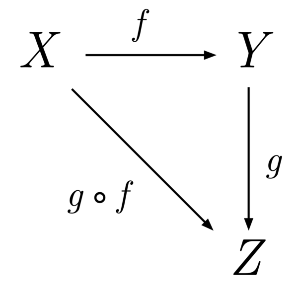
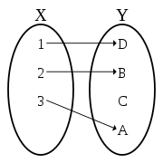
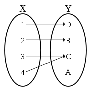
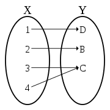

#### category

A category consists of objects and arrows that go between them.

g∘f as “g after f.”

f ∷ A → B

So here’s the first Haskell lesson: Double colon means “has the type of…” A function type is created by inserting an arrow between two types. You compose two functions by inserting a period between them (or a Unicode circle).

#### morphism

There are two objects that are associated to every morphism, the source and the target. A morphism f with source X and target Y is written f : X → Y, and is represented diagrammatically by an arrow from X to Y.

For many common categories, objects are sets (often with some additional structure) and morphisms are functions from an object to another object. Therefore, the source and the target of a morphism are often called domain and codomain respectively.

#### identity function

In mathematics, an identity function, also called an identity relation or identity map or identity transformation, is a function that always returns the same value that was used as its argument. That is, for f being identity, the equality f(x) = x holds for all x.

#### Collapsing function

isEven(): All even numbers => boolean true or false   
decades(): 1980-1989 -> 1980s, 1990-1999 -> 1990s   

#### Injective function (MONIC / Monomorphism)

In mathematics, an injective function (also known as injection, or one-to-one function) is a function that maps distinct elements of its domain to distinct elements of its codomain. In other words, every element of the function's codomain is the image of at most one element of its domain

#### Surjective function (EPIC / Epimorphism)

In mathematics, a function f from a set X to a set Y is surjective (also known as onto, or a surjection), if for every element y in the codomain Y of f, there is at least one element x in the domain X of f such that f(x) = y.

---

If its not Surjective, it means there are points in the domain that don't have a point in codomain.

---

injective non-surjective

injective surjective

non-injective, non-surjective

non-injective, surjective

---

#### Math symbols

1. ∀ - upside down A means "for all"

2. ∃ - backward E means "there exists"

3. ∈ - epsilon (looks like c with horizontal line in middle)
   means "an element of" or "in" of "belongs to"

4. ∋ - backwards epsilon
   means "such that"

5. ∴ - three dots triangle, point up
   means "therefore" or "thus"

6. ∵ - three dots triangle, point down
   means "because" or "due to"

---
### Category Theory 3.1: categories, orders, monoids

smallest category is category of 0 elements.  
Next is 1 element with **identity** function.

*orders* represent a relation (eg. a --> b where a is less than or equial to b)

- a *preorder* will be composable (eg. a --> b --> c, where a is less than b, and b is less than c, then a must be less than c).
- in a *preorder* there is either a relationship or not.  its a binary situation (on or off, related or not)
- a thin category has on preorder and vice-versa

A thin category (or posetal) is a category where homsets each contain at most one morphism.

A homset is the set or collection of all morphisms from A to B for some given ordered pair (A, B) of objects from some given category.

---

A monoid is a set which satisfies **associativity** and has an **identity element** (unit).  

Associativity: (a * b) * c = a * (b * c) holds.

Identity element: There is a **unit** named e where e * a = a and a * e = a.  Much like 1 in multiplication.

