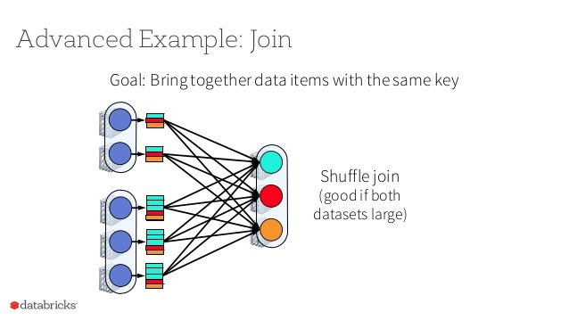
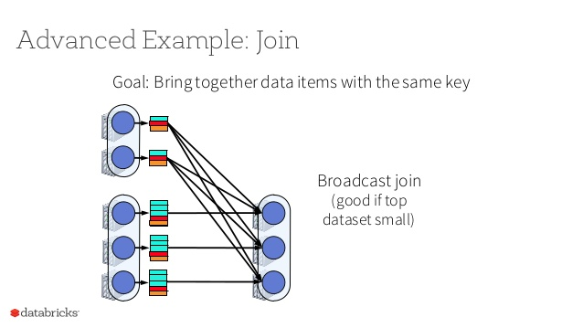
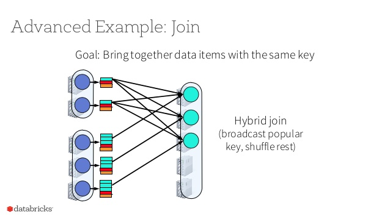
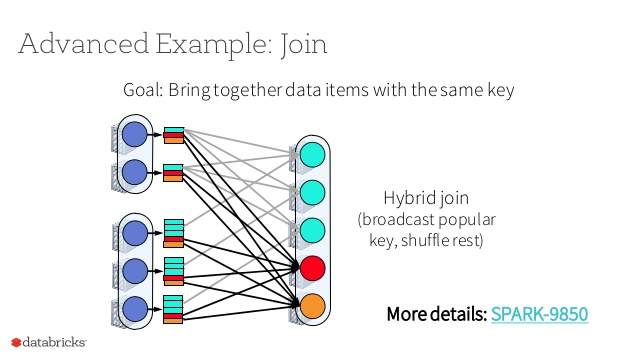

## Review:

#### In broad terms, what is a Join?

A join combines the records of two sets of data and produces a new dataset.  THis is important for data analysis, data processing and storage.  By combining one dataset with 1 or more records from another dataset we can produce a dataset that contains records from both sets.  In the process we make our dataset "wider" (more columns).

Calling join on an RDD will combine the records in two RDDs. .join expects RDD<K,V>, where <K,V> is a two-tuple. The output will be an RDD containing a <K,V> pair with the same key and the values of both RDDs combined for the value.  

- Example:  RDD<String, Double> `join` RDD<String, String> outputs RDD <String, (Double, String)>

A query that accesses multiple rows of the same or different tables at one time is called a _join_ query. [ref](https://www.postgresql.org/docs/current/tutorial-join.html)

`join`returns a DataFrame, untyped
`crossjoin` creates a cartesian join between two DataSets and returns a DataFrame, untyped
`joinwith` creates a join between two DataSets and returns a DataSet, type-preserving

https://jaceklaskowski.gitbooks.io/mastering-spark-sql/content/spark-sql-joins.html

#### How does a shuffle hash join work in Spark?

The shuffle hash join is a join operation that takes two RDDs and shuffles (aka transfers) data over the network so that data from each RDD are collcated on the same partition. Its network transfer makes this an expensive operation, which can only be avoided when the RDDs have a **known partitioner** such as when the preceeding operation passes the same Partitioner to both RDDs.  In that case, the data will be split up the same way and no shuffle will need to take place and the operation becomes a narrow dependency.

#### How does a broadcast join work in Spark?

The broadcast join is a strategy of joining two sets of data, without initiating an expensive shuffle has join.  We do this by taking the smaller dataset (aka RDD) and broadcasting it to each partition.  First, we map over the RDD in the driver, then we broadcast the result to each partition.  Once the data has been broadcast, it is combined with each partition of the larger RDD in a **mapside combine**.  

Another strategy is to use broadcast joins for highly skewed keys in your RDD, you create a HashMap of just these skewed keys and do a broadcast join.  Then, you filter out those keys and do a standard join with the reduced sized data.  Skewed keys are keys whose data are proportionally much larger than the rest of the dataset. 

#### Why are broadcast joins significantly faster than shuffle joins?

Because we are not transfer the entire set of both RDDs across the network, which can be huge amounts of data.  If we have a historical dataset as the RDD to be joined to, and a new (smaller) dataset of last week's data, it makes sense that we would take the smaller amount of data to where the larger dataset is.  

In a way, its intuitive in the same way that Hadoop/Yarn brings the compute to the data during a MapReduce.

#### Why can't we always use broadcast joins?

The memory cost of broadcast joins can be a prohibitive factor.  The default limit for `spark.sql.autoBroadcastJoinThreshold` is 10mb (max 8gb per object), but how useful this is limited by each nodes memory resources.  If we have 20 executors, and we are broadcasting a 1 GB data frame, that will cost us 20 GB of RAM.

#### What is Spark SQL?

Spark SQL is a Spark module built for structured data processing that sits atop Spark.  It facilitates the querying of data using  SQL queries and the Dataset API.  It also includes a cost-based optimizer that helps finds way to make queries more efficient.

#### How does Spark SQL relate to the Spark applications we've been writing, using RDDs?

By adding a relational database like structure for RDDs it allows developers to import relational data from Parquet files and Hive tables, run SQL queries over imported data and existing RDDs and easily write RDDs to Hive tables or Parquet files.

#### How does Spark SQL evaluate a SQL query?

#### What is the catalyst optimizer?

The Catalyst optimizer offers rule-based and cost-based optimization of SQL queries.  It uses these rules and costs to generate multiple execution plans and chooses the lowest cost one.  After analysis, Catalyst creates a **logical optimization plan** applying rule-based optimization (new rules can be added).  Then it takes the logical plan and generates one or more physical plans, evaluates their costs and chooses the lowest cost.  Finally, it generates the code necessary to run on each machine and compiles it into Java bytecode.

deep dive @ databricks: https://databricks.com/blog/2015/04/13/deep-dive-into-spark-sqls-catalyst-optimizer.html

#### Why are there multiple APIs to work with Spark SQL?

They were released at different times, with slightly different functionality.  Spark 1.3 released DataFrames and Spark 1.6 released DataSets as strongly typed DataFrames.  In Spark 2.0 they brought them together.

#### What are DataFrames?

DataFrames are the most common Structured API. similar to tables in SQL or collections in mongo, they represent a table of data with rows and columns.  The list of columns and the types of those columns represent the schema.  They can span multiple machines and have similar incarnations in R and Python (on single machines).

#### What are DataSets?

DataSets are type-safe versions of Spark's structured API for Java and Scala.  They are not available in Python and R because they are dynamically typed.  The DataSet API allows users to assign a Java class to the records inside a DataFrame, and manipulate them as a collection of typed objects.

#### How are DataFrames and DataSets "unified" in Spark 2.0?

DataFrame APIs were merged with the Datasets APIs and a DataFrame is an alias for a collection of generic objects `Dataset[Row]`where row is a generic untyped JVM object.  

#### What is the SparkSession?

In Spark 2.0, its a consolidation of the concepts of Spark Context, SQL Context, and Hive Context .  SparkContext and SQLContext functionality are included out of the box, Hive support can be added with `.enableHiveSupport()` when initializing SparkSession.

#### Can we access the SparkContext via a SparkSession?

Yep, built in.

#### What other contexts are superseded by SparkSession?

SQLContext (for working in Spark SQL, DFs and DSs) and HiveContext for reading and writing to Hive tables.

#### What are some data formats we can query with Spark SQL?

SparkSQL works with SQL/HiveQL, DFs and DSs.

#### Are DataSets lazily evaluated, like RDDs?

Yes, computations are only triggered when an action is invoked.  When an action is invoked Spark's query optimizer optimizes the logical plan and generates a physical plan for efficient execution in a parallel and distributed manner.  You can use .explain() to explore the plans.

#### What are some functions available to us when using DataFrames?

Some functions available to a `Untyped Dataset[Rows]`(aka DataFrame) are:
- `persist`or `cache`
- `createTempView`or `createGlobalTempView`
- `dtypes`: returns all column names and data types as array
- `explain`: prints physical plan `explain(true)` returns all plans
- `printSchema`: returns the schema of the Dataset
- `storageLevel`: returns storage level

#### What's the difference between aggregate and scalar functions?

Aggregate functions operate on groups of values, and scalar functions operate on one value.  

Aggregate functions: `avg(), count(), first(), last(), sum(), max()`
Scalar functions: `col(), ??`

#### How do we convert a DataFrame to a DataSet?

By creating a `case class` and then calling `df.as[SomeCaseClass]` on it.
```
case class Company(name: String, foundingYear: Int, numEmployees: Int)
val inputSeq = Seq(Company("ABC", 1998, 310), Company("XYZ", 1983, 904), Company("NOP", 2005, 83))
val df = sc.parallelize(inputSeq).toDF()

val companyDS = df.as[Company]
companyDS.show()
```

You can also deal with tuples to convert DF to DS without a case class:
```
val rdd = sc.parallelize(Seq((1, "Spark"), (2, "Databricks"), (3, "Notebook")))
val df = rdd.toDF("Id", "Name")

val dataset = df.as[(Int, String)]
dataset.show()
```

#### How do we provide structure to the data contained in a DataSet?

By building a case class ??

#### How do we make a Dataset queryable using SQL strings?

By creating a Temporary view of the table...

#### What is the return type of spark.sql("SELECT * FROM mytable") ?

#### How do we see the logical and physical plans produced to evaluate a DataSet?

```Dataset.explain(extended = true)

== Parsed Logical Plan ==
StreamingRelation DataSource(org.apache.spark.sql.SparkSession@4071aa13,rate,List(),None,List(),None,Map(),None), rate, [timestamp#0, value#1L]

== Analyzed Logical Plan ==
timestamp: timestamp, value: bigint
StreamingRelation DataSource(org.apache.spark.sql.SparkSession@4071aa13,rate,List(),None,List(),None,Map(),None), rate, [timestamp#0, value#1L]

== Optimized Logical Plan ==
StreamingRelation DataSource(org.apache.spark.sql.SparkSession@4071aa13,rate,List(),None,List(),None,Map(),None), rate, [timestamp#0, value#1L]

== Physical Plan ==
StreamingRelation rate, [timestamp#0, value#1L]
```

####  What is a join condition?

A join condition (aka join expression) relate two tables in some logical way.  When the join condition is met, the rows matched will be returned to be operated on.

####  What is the difference between inner, outer left, outer right, and outer full joins?

**Inner joins** returns records that match values on both tables.
**Left Outer Joins** Returns all records from the left table and the matched records from the right table, unmatched records will be NULL.
**Right Outer Joins** Returns all records from the right table, if no matching row from the left table exists, NULL will appear in the row.
**Full Outer Joins** Returns records from both sides, unmatched rows will show as NULL.


####  What is a cross join / cartesian join?

A **cartesian** or **cross join** returns all records from the one table combined with every row of the tables it is being joined to.  In other words, every possible combination.

####  If I join two datasets with 10 records each, what is the maximum possible number of records in the output?

A **full outer join** would output 10 rows.

####  How many records would be in the output of a cross join/cartesian join?

A **cartesian join**  would produce an output of 100 records. 

####  What is Parquet?

Parquet is a columnar storage format available to Hadoop projects, its highly efficient and uses several methods of compression and encoding to reduce the overall size of data and provides significate performance gains by eliminating non-matches early, and saving the cost of processing in later stages through  predicate pushdown.  

Parquets columnar format has the advantage over rows in that we dont have to scan over entire rows to get selected column data out of each row, instead they are contained together on the disk, adjacent to one another and we can get that data back without reading the entire row.

Parquet helps reduce query latency even farther than static partitioning, along with Dictionary encoding, Bit packing and RLE (run length encoding)  Parquet offers an alternative solution to SQL databases.

####  What does it mean that parquet is columnar storage?

Columnar storage means that data is not organized into rows of multiple columns with one row of data including many columns.  Instead the data is stored with other data of the same kind.  A column for year would be stored with all the years together. These groups of column data would be stored in a **Row Group**, which is some number of rows.  Each **Row Group** has a **File Footer** which contains the metadata for that row group.

####   Parquet is stored efficiently on disk and is easy to query, traits that make it useful for big data. What are the downsides of the parquet format?

The downsides of the parquet format is that it is not as easy to write to, making edits to and appending new data is a time-consuming and a process that  takes meticulousness.  Because data is immutable, making changes means that you have to overwrite the file/write a new file(?).  It also is a binary format, and tools for working with it are  not as ubiquitous as with text files.

####   How can Parquet's columnar storage efficiently encode the column values: "Kentucky, Kentucky, Kentucky, Kentucky, Virginia, Virginia, Virginia"?

By using Dictionary and Run-Length encoding.  A table identifying "Kentucky" as `id 1` and Virginia as `id 2` and storing them as `4,1 3,2` where 4 represents the number of instances of Kentucky, and 1 represents its `id`.

####   What is RLE?

Run Length encoding is a form of lossless compression that is often used in lossless image compression.  By counting elements of a recurring pattern and then post-pending a single instance of the pattern with the count, significant savings can often be had.  An example:

`butbutbutbutterparkay`=> `but4terparkay`
`aaaaabbbbbbcbcb`=> `a5b6cb2`

####  What is Dictionary encoding?

Dictionary encoding is achieved by building a dictionary of values found in a given column.  The dictionary is stored per column chunk as integers using the RLE/Bit-packing hybrid encoding.  If it grows too large, encoding will fall back to plain encoding.

####   How can we partition files we write using dataframes in Spark?

`df.write.partitionBy(value)`

Bucket can be done with:
`df.write.bucketBy(42, "name")`

####  How is a partitioned parquet file stored in the filesystem?

A partitioned parquet file is divided into subfolders that correspond to:
`<column name>=<value>`
```
   .----- date_year=2020                        .--- part-00001
--|			   .--- date_month=01 --|
   '---- date_year=2019 --|                     '--- part-00002
		           `--- date_month=02
```

####   What are some benefits of storing your data in partitions?

We benefit by dividing our data into partitions that we care about (low cardinality).  This we way we can filter out data and reduce the amount of data that we are querying on.  If we partition our data into "cities" and are looking for just "Reston", we can leave out every other city's data.

A common partitioning style is by date (year-month-day).

#### What does it mean to push down predicates in relation to Parquet?

Pushing down predicates is a strategy used by Parquet to filter out data by adding a lower level filter that discards non-matching records before assembling and returning them to the requestor.  

The idea is to move the predicate (`WHERE` statements) closer to the data source engine to increase the performance of queries by removing extraneous data, rather than after it has been loaded to Spark's memory.

---

#### Broadcast Joins
(aka Map-side Joins or broadcast hash join)

spark.sql.autoBroadcastJoinThreshold - max. size (in bytes) for a table that will be broadcast to all worker nodes when performing a join). 
- default: 10L * 1024 * 1024 (10MB)

Broadcast joins can be very efficient for joining a relatively small table with a larger table, by avoiding the need to shuffle and send the large table over the network. 

```
val q = large.join(broadcast(small), "id")
val plan = q.queryExecution.logical
scala> println(plan.numberedTreeString)

00 'Join UsingJoin(Inner,List(id))
01 :- Range (0, 100, step=1, splits=Some(8))
02 +- ResolvedHint (broadcast)
03    +- Range (0, 1, step=1, splits=Some(8))
```

Deep dive into joins: https://www.oreilly.com/library/view/high-performance-spark/9781491943199/ch04.html

Image below from https://www.slideshare.net/databricks/new-developments-in-spark









---

#### SBT overview 
- https://www.slideshare.net/hermannhueck/pragmatic-sbt


--- 
#### Catalyst and Spark SQL

The Catalyst extensible query optimizer helps develop a physical plan to select the lowest-cost plan for processing data.  The sequence of events is:
- unresolved logical plan
- reads catalog and generates a logical plan
- creates an optimized logical plan
- creates multiple physical plans
- evalutes the best solution usijg cost method
- selects a physical plan
- generates RDDs

#### Dataframes and Datasets

DataFrames have named columns and a structure like SQL/collection tables.  They hold data in records and have columns with datatypes.

DataSets are between DataFrames and RDDs, they contaiun strongly typed collections of distributed data.  Content of a DataSet is typically a Scala case class.  

They are both distributed collections of data that are processed using the catalyst optimzer to convert them to RDD.  

In Spark 2.0 they are unified and DataFrame is just a DataSet that contains generic Row objects instead of specific Scala case classes.

ex: DataSet[Comic] - a dataset of comics, DataSet[Person] a dataset of persons, DataSet[Row] means a dataset containing generic Rows - or a DataFrame.  We can also call DataFrames "untyped DataSets".


